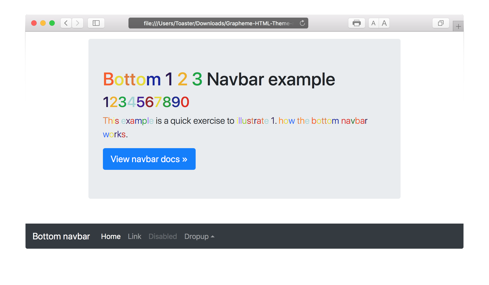

# graphemetheme

## Links

[Project Page](https://carlosvegame.github.io/Grapheme-HTML-Theme/)

[Demo](https://htmlpreview.github.io/?https://github.com/CarlosVegaMe/Grapheme-HTML-Theme/blob/master/index.html)

[Wikipage](https://github.com/CarlosVegaMe/Grapheme-HTML-Theme/wiki)

## Version

     VERSION: BETA 1.0.1

# Description:

The Grapheme Theme is a Bootstrap based theme for freelancers. This theme was built using jQuery Highlight Plugin and Bootstrap version 3.1.1. This theme is based off Graphemic-Color Synaesthesia and Marc-Jacques Mächler's articled titled Synaesthesia and Learning A Differentiated View of Synaesthetic Perceptional Awareness.

Please view Wiki page for more info 

## Features:

- Color is added to each letter automatically on load
- Fixed top navigation that collapses on scroll
- Responsive
